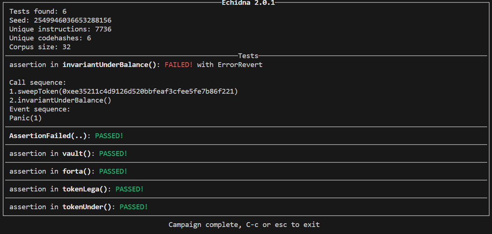

# DoubleEntryPoint

[DoubleEntryPoint](https://ethernaut.openzeppelin.com/level/0x9451961b7Aea1Df57bc20CC68D72f662241b5493)

1. The `CryptoVault` has a balance from two tokens called `DoubleEntryPoint`, and `LegacyToken`
1. The `DoubleEntryPoint` token exposes the `DelegateERC20` interface that effecively allows any other token to wrap it.
1. This wrapping means that tokenX can forward transfers to `DoubleEntryPoint`. Whereas the caller might think he is transferring tokenX, it is infact transfering the `DoubleEntryPoint` token.
1. This is exactly what `LegacyToken` is doing. It is forwarding transfers to `DoubleEntryPoint`.
1. Hence when `CryptoVault` tries transfering its `LegacyToken` it is effectively transferring its `DoubleEntryPoint`.
1. To block this attack we need to detect transfers whose original sender is `CryptoVault`.


<BR />

## Attack Test

```DASH
forge test -vvvv
```


<BR />

## Live Attack

```BASH
./attackDeploy.sh
./attackDo.sh
```

<BR />

## Vulnerability Testing Tools


<BR />

### Slither

Slither only used to generate contract summary...

```BASH
solc-select install 0.8.19
solc-select use 0.8.19

slither ./src/CryptoVault.sol --print contract-summary  \
       --solc-remaps "openzeppelin-contracts/=lib/openzeppelin-contracts/contracts/"
```

<BR />

### Echidna Fuzzing


__Bug Detected on EVERY run!__

Testing invariant condition with minimal help to guide the test. <BR /> 
Invariant: _Underlying token balance should not change._


```BASH
make echidna
```



<BR />


### Foundry Fuzzing

_Bug Detected AFTER 6 Runs__

Testing invariant condition with minimal help to guide the test. <BR /> 
Invariant: _Underlying token balance should not change._

```BASH
forge test -vvv
```

```
forge test
[⠢] Compiling...
No files changed, compilation skipped

Test result: ok. 0 passed; 0 failed; 0 skipped; finished in 2.84ms

Running 2 tests for test/InvariantTest.t.sol:InvariantTest
[FAIL. Reason: Assertion failed.]
        [Sequence]
                sender=0x6c6fb4c690654ec81f7005765fd306682af8490c addr=[src/Forta.sol:Forta]0x5615deb798bb3e4dfa0139dfa1b3d433cc23b72f calldata=notify(address,bytes), args=[0x9F1756cD20766bCD9c0Af8643dcDa0dEF4C0c9c5, 0x142b87f86d908735c8dcb4689263553c81b41ef28d25759fa447b1d4987f8647bd581c]
                sender=0x64d9f5257695e537cabc6e7db1772d54c08fe85d addr=[src/CryptoVault.sol:CryptoVault]0x2e234dae75c793f67a35089c9d99245e1c58470b calldata=setUnderlying(address), args=[0xEa70477cfF14f919e6cB5B7899a8Cd6Fd0c0c0dD]
                sender=0x7f26fe15290c2809123467fde2c47656a1ba7a4a addr=[src/CryptoVault.sol:CryptoVault]0x2e234dae75c793f67a35089c9d99245e1c58470b calldata=sweepToken(address), args=[0xF62849F9A0B5Bf2913b396098F7c7019b51A820a]

 invariant_UnderBalance() (runs: 210, calls: 3138, reverts: 1836)
[PASS] testShow() (gas: 89831)
Test result: FAILED. 1 passed; 1 failed; 0 skipped; finished in 165.35ms

Running 1 test for test/TestAttack.t.sol:TestAttack
[PASS] testFail_RaisedAlert() (gas: 136790)
Test result: ok. 1 passed; 0 failed; 0 skipped; finished in 2.16s
Ran 3 test suites: 2 tests passed, 1 failed, 0 skipped (3 total tests)

Failing tests:
Encountered 1 failing test in test/InvariantTest.t.sol:InvariantTest
[FAIL. Reason: Assertion failed.]
        [Sequence]
                sender=0x6c6fb4c690654ec81f7005765fd306682af8490c addr=[src/Forta.sol:Forta]0x5615deb798bb3e4dfa0139dfa1b3d433cc23b72f calldata=notify(address,bytes), args=[0x9F1756cD20766bCD9c0Af8643dcDa0dEF4C0c9c5, 0x142b87f86d908735c8dcb4689263553c81b41ef28d25759fa447b1d4987f8647bd581c]
                sender=0x64d9f5257695e537cabc6e7db1772d54c08fe85d addr=[src/CryptoVault.sol:CryptoVault]0x2e234dae75c793f67a35089c9d99245e1c58470b calldata=setUnderlying(address), args=[0xEa70477cfF14f919e6cB5B7899a8Cd6Fd0c0c0dD]
                sender=0x7f26fe15290c2809123467fde2c47656a1ba7a4a addr=[src/CryptoVault.sol:CryptoVault]0x2e234dae75c793f67a35089c9d99245e1c58470b calldata=sweepToken(address), args=[0xF62849F9A0B5Bf2913b396098F7c7019b51A820a]

 invariant_UnderBalance() (runs: 210, calls: 3138, reverts: 1836)

Encountered a total of 1 failing tests, 2 tests succeeded
```

<BR />
